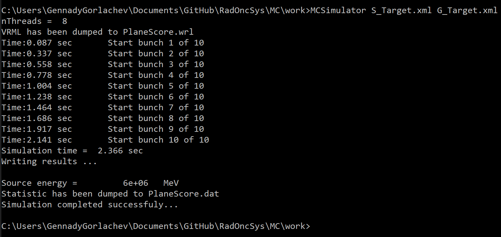
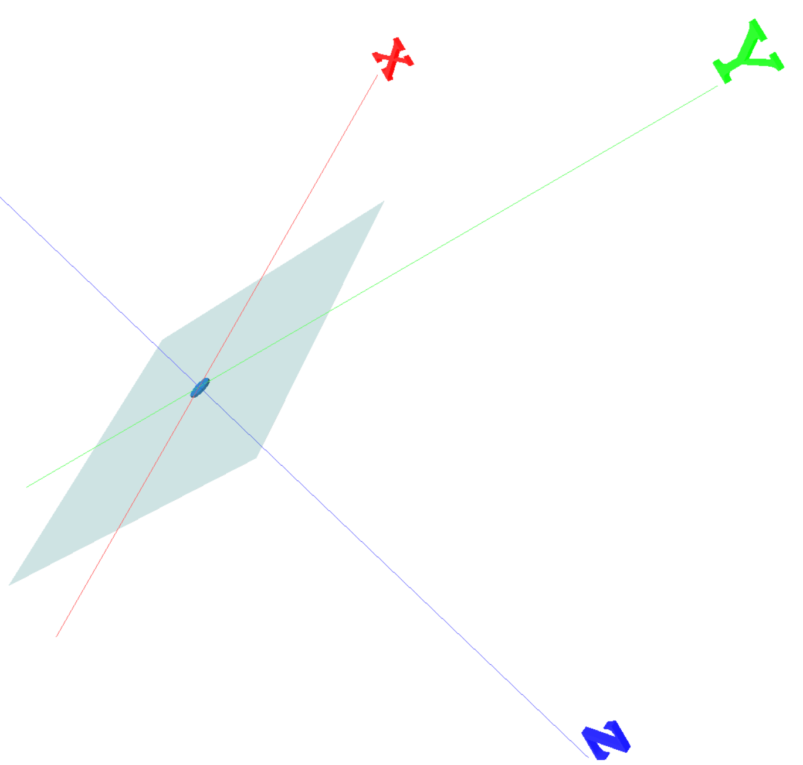
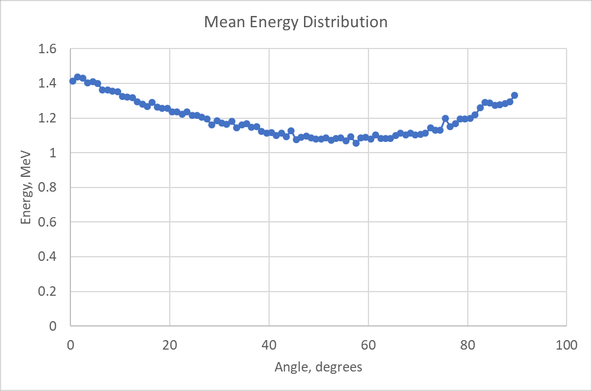

Examples
========

This chapter contains some examples of using reference application for radiation transport simulations.
Configuration files format is not explained here in detail.
See complete description in the chapter 
:ref:`ch_reference_application`

Simple bremsstrahlung
^^^^^^^^^^^^^^^^^^^^^

In order to run simulation of *bremsstrahlung* production using reference application
you need to prepare two task description *XML* configuration files.

Here is an example of first one geometry description file *G_Target.xml*:

.. code-block:: XML

    <?xml version="1.0" encoding="utf-8"?>
    <accelerator>
        <!--Tungsten target-->
        <module type="cylinder" name="Target" medium="W700ICRU" density="1">
            <Color r="0" g="0.5" b="1" t="0.2" />
            <position unit="cm" x="0" y="0" z="0" />
            <normal x="0" y="0" z="1" />
            <xaxis x="1" y="0" z="0" />
            <size unit="cm" radius="1.0" height="0.2"/>
        </module>
        <module type="planefilter" name="Trap" medium="AIR700ICRU" density="1">
            <Color r="0" g="0.5" b="0.5" t="0.8" />
            <position unit="cm" x="0" y="0" z="0.2" />
            <normal x="0" y="0" z="1" />
            <xaxis x="1" y="0" z="0" />
        </module>
    </accelerator>

Geometry consists of two modules. 
First is cylindrical tungsten target with front plane located in the coordinate system origin.
Its *Z* axis directed along the world *Z* axis.
Target thickness is 0.2 cm and radius is 1.0 cm.

The second module is a plane filter dedicated to host scoring object defined in simulation file.
It is located at the level of back plane of the target (*z* = 0.2).

Next is an example of simulation description file *S_Target.xml*: 

.. code-block:: XML

    <?xml version="1.0" encoding="utf-8"?>
    <!-- Bremsstrahlung production by electron beam on the target -->
    <input>
        <simulation nhistories="100000" nbanches="10">
        </simulation>
        <options>
            <vrmlfile>PlaneScore.wrl</vrmlfile>
            <statfile>PlaneScore.dat</statfile>
            <transCutoff_elec unit="MeV" ecat ="0.0"/>
        </options>
        <source name="Electron beam" module="Target" trackparticles="false">
            <radiation type="electron" energy="6.0" />
            <shape direction="conical" size="0.00" angle="0"/>
            <position unit="cm" x="0" y="0" z="-1.0" />
            <direction x="0" y="0" z="1" />
        </source>
        <score type="fluence_plane" module="Trap" pt="photon"/>
    </input>

This file prescribes *1E6* particles, which sampling from *"Electron beam"* source.
Point source is located at the world Z axis at -1.0 cm distance from its origin
and emits electrons with energy 6 *MeV* along Z axis.
First object that electrons will hit is directly indicated and it is module *"Target"*.

Scoring type is *"fluence_plane"*.
It is connected to module *"Trap"*.
Scoring is accounting only photons.
*Electrons* and *negatrons* will be ignored.

To start simulation go to the directory of the simulation configuration files 
and run the following command:

::

   MCSimulator S_Target.xml G_Target.xml

.. note:: 
   *MCSimulator* requires that PEGS file *AcceleratorSimulator.pegs4dat*
   must be located at *../data* folder.

Next figure 
:numref:`(Fig. %s) <_target_sim_proc-figure>`.
shows screenshot of simulation process.

    Simulation process screenshot.

Simulation will produce two files.
According to configuration simulation scene 
will be written in *VRML* graphical format file *PlaneScore.wrl*.
Next figure
:numref:`(Fig. %s) <_plane_score_wrl-figure>`.
shows its content in *VrmlView* application.

    Simulation scene graphical view.

Second file *PlaneScore.dat* is a dump of scoring content.
In this case it is simple text file with a few distributions,
which easily can be analyzed, for example, in EXCEL.
Next figure
:numref:`(Fig. %s) <_plane_score_stat-figure>`.
shows mean energy distribution depending on direction as an example.

    Statistic on mean photon energy distribution depending of direction of bremsstrahlung.
