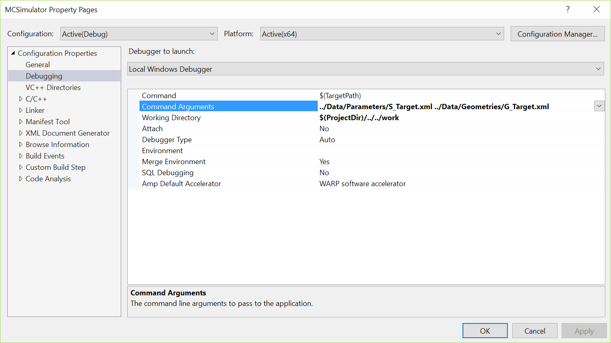

Getting started
===============

Installation
^^^^^^^^^^^^

Project assume to build under **Visual Studio 2017 Community edition**.

To build it just clone or download it from the **GitHub** and open solution.

Solution consists of four projects.

.. list-table:: List of projects
   :name: _projects-table
   :widths: 5, 15
   :width: 90%
   :header-rows: 1

   * - Project
     - Description
   * - **Geometry**
     - Small internal use geometry base classes, like vectors, matrixes, planes, etc
   * - **MC**
     - Core *Monte Carlo* library
   * - **MC.Tests**
     - Some collection of tests. Valuable learning resource
   * - **MCSimulator**
     - Complex executable, which uses full power of MC library and can be used standalone.
       Most practical tasks can be completely described by XML input files

Running simulations
^^^^^^^^^^^^^^^^^^^

**MC** library can be used to program custom tasks. Source code for **MCSimulator** 
fully demonstrates how to do that and can be considered as reference implementation. 
It is very like **EGS4** workflow.

**MCSimulator** can be used as ready to use *Monte Carlo* simulator. 
It takes two *XML* input files to describe the task. First file describes simulation conditions. 
Second file describes simulation geometry.

**Data/XML** folder contains some input examples.

To run simulations you need to create a folder for the task and 
copy there **MCSimulator.exe** and input files.
Then you need to have side by side to this folder data folder 
with **PEGS4** input file (**AcceleratorSimulator.pegs4dat** for now).

Here are some examples to run simulations from the samples data:

.. code-block:: language

   MCSimulator S_C60_sphere.xml G_C60_sphere.xml
   MCSimulator S_CK_6X.xml G_CyberKnife.xml
   MCSimulator S_Ross.xml G_Ross.xml
   MCSimulator S_Target.xml G_Target.xml

Output and visualization
^^^^^^^^^^^^^^^^^^^^^^^^

**MCSimulator** produces two output files. 
Their names indicated in simulation conditions **XML** file. 
One file (**.dat**) contains numerical results of simulations. 
The other one is **VRML** graphical dump (**.wrl**). It can be viewed many **VRML** viewers. 
The recommended old style perfect one can be unzipped from this project **./Data/vrmlview.zip** file.

Debugging
^^^^^^^^^

Debugging is a valuable tool to study code.

To run *MCSimulator* in debug build debug version. Click right mouse button over 
*MCSimulator* project in the Solution Explorer and select Set as StartUp Project.

*MCSimulator* by default uses all *CPU* cores.
This will cause difficulties in stepping in the code due to jumping through different threads.
You can switch to single thread by directly setting variable nThreads to one in the main function. 
See fragment of *MCSimulator.cpp* below.

.. code-block:: CPP

   int i;
   //int nThreads = concurrency::GetProcessorCount();
   int nThreads = 1;
   
The tricky part is providing program arguments and working directory. 
It should be done through the MCSimulator project properties. 
One possible scenario for the GitHub version of folders structures is shown in the next figure
:numref:`(Fig. %s) <_debug_properties-figure>`.
First time create folder *MC\work* where you will run debug simulation.

    Debug Properties.

Then start debugging.

Remember about the code execution performance. 
In the past the difference in speed between debug and release was of the order of 2. 
Modern compiler continuously improve and use hardware features including GPU even if programmer did not request that. 
Now the speed up can be up to an order or more depending on code.
